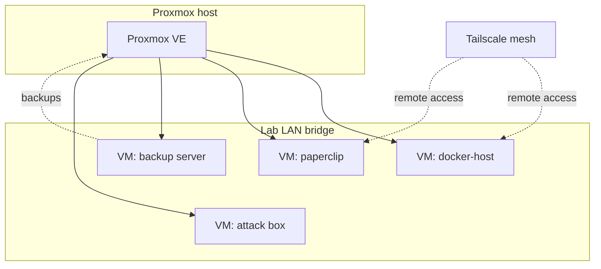

# lab-ops

> Infrastructure-as-code for a single-node Proxmox homelab: host baseline in Ansible, services in Docker Compose, configuration in git.

**Status:** Active · **Updated:** 2026-10-08

## Overview

This repository expresses a single-node [Proxmox VE](https://www.proxmox.com/) homelab
as code. One physical host runs the hypervisor; a handful of VMs run Docker and other
workloads on top of it. The goal is that the interesting state of the lab lives in
version control rather than in a bunch of hand-edited files on a box that only I
remember the shape of.

The approach is GitOps-lite:

- **Host baseline** is an Ansible role (`common`) that every VM gets: an admin user,
  SSH hardening, a host firewall, and automatic security updates.
- **Services** are Docker Compose stacks with pinned image tags and named volumes, so a
  rebuild is reproducible rather than archaeological.
- **Secrets stay out of git.** Only `.example` files are committed; real values come from
  a local `.env`, Ansible Vault, or 1Password.
- **Dependencies are watched** by Renovate, which opens pull requests when a pinned image
  or action has an update.

The narrative write-ups - why things are built the way they are, what broke, and what I
learned - live in the companion repository:
[Dstanfield-Creator/projects](https://github.com/Dstanfield-Creator/projects). This repo
is the machine-readable half; that one is the prose.

## Architecture



## Repository Layout

```text
lab-ops/
├── ansible/                 # Host baseline as code
│   ├── ansible.cfg          # Inventory path, SSH defaults
│   ├── inventory.example.ini # Example inventory (copy to inventory.ini)
│   ├── group_vars/          # Example variable overrides
│   ├── playbooks/           # Entry-point playbooks (baseline.yml)
│   └── roles/common/        # Admin user, SSH hardening, UFW, updates
├── compose/                 # Docker Compose service stacks
│   ├── monitoring/          # Prometheus, Grafana, exporters
│   └── services/            # Reverse proxy, automation, status page
├── proxmox/                 # Hypervisor notes: API tokens, PBS backups
├── scripts/                 # Lab power + reachability helpers (pointers)
├── renovate.json            # Dependency update automation config
├── LICENSE
└── README.md
```

## Tech Stack

| Layer            | Tool                     | Role in the lab                              |
| ---------------- | ------------------------ | -------------------------------------------- |
| Hypervisor       | Proxmox VE               | Runs the VMs on the single physical host     |
| Guest OS         | Debian                   | Base image for every VM                      |
| Config mgmt      | Ansible                  | Applies the `common` host baseline           |
| Services         | Docker Compose           | Runs containerised workloads on docker-host  |
| Observability    | Prometheus / Grafana     | Metrics collection and dashboards            |
| Remote access    | Tailscale                | Mesh VPN; no ports exposed to the internet   |
| Dependency bot   | Renovate                 | Opens PRs for image and action updates       |
| CI               | GitHub Actions           | Lint and validate on push (added separately) |

## Usage

Apply the host baseline to all inventory hosts:

```bash
cd ansible
cp inventory.example.ini inventory.ini   # then edit for your hosts
cp group_vars/all.example.yml group_vars/all.yml
ansible-playbook playbooks/baseline.yml
```

Run against a single host, or check what would change first:

```bash
ansible-playbook playbooks/baseline.yml --limit docker-host --check --diff
```

Bring up a Compose stack (monitoring shown; `services` is the same shape):

```bash
cd compose/monitoring
cp .env.example .env                      # then fill in local values
docker compose pull
docker compose up -d
docker compose ps
```

## Secrets

Nothing secret is committed to this repository.

- Every stack ships a `.env.example`; the real `.env` is git-ignored and lives only on
  the host.
- Ansible variables that carry secrets are kept in Ansible Vault, or pulled from
  1Password at run time, never in plain `group_vars`.
- Only RFC 5737 documentation addresses (`192.0.2.0/24`), `example.com`, and
  `example.ts.net` appear in committed files. Substitute your own before use.

---

**Author:** Danny Stanfield · Perth, WA

**License:** MIT
